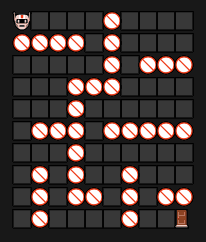

# Robot-Solving-Maze

## Overview
Robot-Solving-Maze is a Go application that simulates a robot navigating through a 10x10 grid while avoiding obstacles. The robot finds the shortest path from the start position (0,0) to the target position (9,9) using Dijkstra's algorithm. The application visualizes the robot's movement in the terminal.


## Features
- Reads obstacles from a CSV file.
- Constructs a graph representation of the grid.
- Uses Dijkstra's algorithm to find the shortest path.
- Visualizes the robot's movement in the terminal.
- Allows customization of grid size, target position, and obstacle placement

## Prerequisites
- Go 1.18 or later installed on your system.
- Visual Studio Code to view animation

## Installation
1. Clone the repository:
   ```sh
   git clone https://github.com/b0tShaman/Robot-Solving-Maze.git
   ```
2. Navigate to the project directory:
   ```sh
   cd Robot-Solving-Maze
   ```
3. Ensure you have a CSV file named `obstacle.csv` in the project root, formatted as:
   ```csv
   x,y
   3,4
   5,6
   7,8
   ```

## Usage
Run the program using:
```sh
 go run main.go
```
